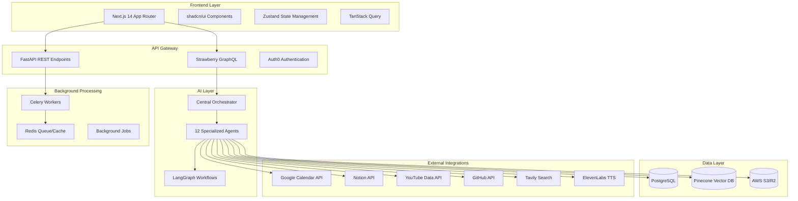
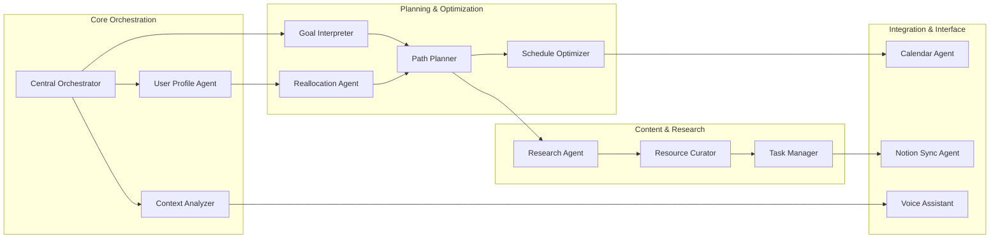

# Design Document: Adaptive Learning Platform

## Overview

The Adaptive Learning Platform is a sophisticated AI-powered web application that orchestrates personalized learning experiences through a multi-agent architecture. The system combines modern web technologies with advanced AI workflows to create dynamic, adaptive learning paths that evolve based on user progress and feedback.

### Key Design Principles

- **AI-First Architecture**: Multi-agent system using LangGraph for intelligent orchestration
- **Real-time Adaptability**: Dynamic path reallocation based on user performance and feedback
- **Seamless Integration**: Native connectivity with Google Calendar and Notion for workflow integration
- **Modern UX**: Glassy, dark-mode-first interface with smooth micro-interactions
- **Scalable Performance**: Async processing with background job queues and caching strategies

## Architecture

### High-Level Architecture



### Multi-Agent System Architecture

The AI layer consists of 12 specialized agents orchestrated through LangGraph workflows:



## Components and Interfaces

### Frontend Components

#### Core UI Components
- **Dashboard**: Real-time learning progress with WebSocket updates
- **Learning Path Visualizer**: Interactive milestone progression with glassy cards
- **Resource Browser**: Searchable, filterable content library
- **Voice Interface**: STT/TTS integration with visual feedback
- **Onboarding Wizard**: Multi-step skill assessment and integration setup

#### State Management Architecture
```typescript
// Zustand store structure
interface AppState {
  user: UserState;
  learningPath: LearningPathState;
  resources: ResourceState;
  voice: VoiceState;
  ui: UIState;
}

interface UserState {
  profile: UserProfile;
  progress: UserProgress;
  preferences: UserPreferences;
}

interface LearningPathState {
  currentPath: LearningPath;
  milestones: Milestone[];
  completedTasks: Task[];
  upcomingTasks: Task[];
}
```

### Backend API Layer

#### GraphQL Schema (Strawberry)
```python
@strawberry.type
class User:
    id: strawberry.ID
    email: str
    profile: UserProfile
    learning_paths: List[LearningPath]
    progress: UserProgress

@strawberry.type
class LearningPath:
    id: strawberry.ID
    title: str
    description: str
    difficulty_level: DifficultyLevel
    milestones: List[Milestone]
    estimated_duration: int
    created_at: datetime
    updated_at: datetime

@strawberry.type
class Milestone:
    id: strawberry.ID
    title: str
    description: str
    tasks: List[Task]
    resources: List[Resource]
    completion_criteria: str
    estimated_hours: int
```

#### FastAPI REST Endpoints
```python
# Core API endpoints
@app.post("/api/v1/onboarding/assess-skills")
async def assess_skills(assessment: SkillAssessment) -> AssessmentResult

@app.post("/api/v1/learning-paths/generate")
async def generate_learning_path(request: PathGenerationRequest) -> LearningPath

@app.post("/api/v1/voice/process")
async def process_voice_command(audio: UploadFile) -> VoiceResponse

@app.post("/api/v1/reallocate")
async def trigger_reallocation(feedback: UserFeedback) -> ReallocationResult

@app.get("/api/v1/integrations/calendar/sync")
async def sync_calendar() -> CalendarSyncStatus

@app.get("/api/v1/integrations/notion/sync")
async def sync_notion() -> NotionSyncStatus
```

### Multi-Agent System Components

#### Central Orchestrator Agent
```python
class CentralOrchestrator:
    """Coordinates all agent interactions and maintains system state"""
    
    async def process_user_request(self, request: UserRequest) -> AgentResponse:
        # Analyze request context
        context = await self.context_analyzer.analyze(request)
        
        # Route to appropriate agents
        if request.type == "path_generation":
            return await self.coordinate_path_generation(context)
        elif request.type == "reallocation":
            return await self.coordinate_reallocation(context)
        elif request.type == "voice_command":
            return await self.coordinate_voice_processing(context)
```

#### Specialized Agent Interfaces
```python
class PathPlannerAgent:
    """Generates structured learning paths based on user goals and constraints"""
    
    async def generate_path(self, user_profile: UserProfile, goals: List[Goal]) -> LearningPath:
        # Analyze skill gaps
        gaps = await self.analyze_skill_gaps(user_profile, goals)
        
        # Create milestone progression
        milestones = await self.create_milestone_sequence(gaps)
        
        # Optimize for user constraints
        optimized_path = await self.optimize_for_constraints(milestones, user_profile.constraints)
        
        return optimized_path

class ResourceCuratorAgent:
    """Discovers and curates educational resources from multiple sources"""
    
    async def curate_resources(self, milestone: Milestone) -> List[Resource]:
        # Multi-source search
        youtube_resources = await self.search_youtube(milestone.topics)
        github_resources = await self.search_github(milestone.topics)
        article_resources = await self.search_articles(milestone.topics)
        
        # Rank and filter
        ranked_resources = await self.rank_resources([
            *youtube_resources, *github_resources, *article_resources
        ])
        
        return ranked_resources[:10]  # Top 10 resources per milestone
```

## Data Models

### Core Entity Models

#### User and Profile Models
```python
class User(BaseModel):
    id: UUID
    email: str
    auth0_id: str
    created_at: datetime
    updated_at: datetime
    is_active: bool = True

class UserProfile(BaseModel):
    id: UUID
    user_id: UUID
    display_name: str
    skill_levels: Dict[str, SkillLevel]  # topic -> proficiency level
    learning_preferences: LearningPreferences
    availability_schedule: Dict[str, List[TimeSlot]]  # day -> available slots
    timezone: str
    goals: List[LearningGoal]
    integrations: IntegrationSettings

class LearningPreferences(BaseModel):
    preferred_content_types: List[ContentType]  # video, article, code, etc.
    learning_pace: LearningPace  # slow, moderate, fast
    difficulty_preference: DifficultyPreference  # gradual, challenging
    session_duration_preference: int  # minutes
```

#### Learning Path Models
```python
class LearningPath(BaseModel):
    id: UUID
    user_id: UUID
    title: str
    description: str
    difficulty_level: DifficultyLevel
    estimated_total_hours: int
    milestones: List[Milestone]
    status: PathStatus  # active, completed, paused
    created_at: datetime
    updated_at: datetime
    completion_percentage: float

class Milestone(BaseModel):
    id: UUID
    learning_path_id: UUID
    title: str
    description: str
    order_index: int
    tasks: List[Task]
    resources: List[Resource]
    completion_criteria: str
    estimated_hours: int
    prerequisites: List[UUID]  # other milestone IDs
    status: MilestoneStatus
    due_date: Optional[datetime]

class Task(BaseModel):
    id: UUID
    milestone_id: UUID
    title: str
    description: str
    task_type: TaskType  # read, watch, code, practice, quiz
    estimated_minutes: int
    resources: List[Resource]
    completion_status: TaskStatus
    scheduled_at: Optional[datetime]
    completed_at: Optional[datetime]
```

#### Resource and Content Models
```python
class Resource(BaseModel):
    id: UUID
    title: str
    description: str
    resource_type: ResourceType  # video, article, repository, course, pdf
    source_platform: SourcePlatform  # youtube, github, web, etc.
    url: str
    metadata: ResourceMetadata
    difficulty_level: DifficultyLevel
    estimated_duration: int  # minutes
    tags: List[str]
    quality_score: float  # 0-1, based on curation algorithm
    created_at: datetime

class ResourceMetadata(BaseModel):
    author: Optional[str]
    published_date: Optional[datetime]
    view_count: Optional[int]
    rating: Optional[float]
    language: str = "en"
    file_size: Optional[int]  # for downloadable resources
    thumbnail_url: Optional[str]
```

#### Progress Tracking Models
```python
class UserProgress(BaseModel):
    id: UUID
    user_id: UUID
    learning_path_id: UUID
    current_milestone_id: Optional[UUID]
    completed_milestones: List[UUID]
    completed_tasks: List[UUID]
    total_study_time: int  # minutes
    streak_days: int
    last_activity: datetime
    performance_metrics: PerformanceMetrics

class PerformanceMetrics(BaseModel):
    completion_rate: float  # percentage of tasks completed on time
    average_session_duration: int  # minutes
    preferred_study_times: List[int]  # hours of day (0-23)
    difficulty_adaptation_score: float  # how well user handles difficulty
    engagement_score: float  # based on interaction patterns
```

#### Reallocation and Adaptation Models
```python
class Reallocation(BaseModel):
    id: UUID
    user_id: UUID
    learning_path_id: UUID
    trigger_reason: ReallocationReason  # behind_schedule, too_easy, too_hard, user_feedback
    original_milestone_id: UUID
    new_milestone_id: Optional[UUID]
    changes_made: List[PathChange]
    confidence_score: float  # AI confidence in the reallocation
    user_approved: Optional[bool]
    created_at: datetime
    applied_at: Optional[datetime]

class PathChange(BaseModel):
    change_type: ChangeType  # add_milestone, remove_milestone, modify_resources, reschedule
    target_id: UUID  # milestone or task ID
    old_value: Optional[Dict]
    new_value: Dict
    reasoning: str

class ConversationContext(BaseModel):
    id: UUID
    user_id: UUID
    session_id: str
    conversation_history: List[ConversationTurn]
    current_intent: Optional[str]
    context_variables: Dict[str, Any]
    created_at: datetime
    updated_at: datetime

class ConversationTurn(BaseModel):
    timestamp: datetime
    user_input: str
    agent_response: str
    intent_detected: str
    confidence_score: float
    actions_taken: List[str]
```

### Database Schema Design

#### PostgreSQL Tables
```sql
-- Core user tables
CREATE TABLE users (
    id UUID PRIMARY KEY DEFAULT gen_random_uuid(),
    email VARCHAR(255) UNIQUE NOT NULL,
    auth0_id VARCHAR(255) UNIQUE NOT NULL,
    created_at TIMESTAMP WITH TIME ZONE DEFAULT NOW(),
    updated_at TIMESTAMP WITH TIME ZONE DEFAULT NOW(),
    is_active BOOLEAN DEFAULT TRUE
);

CREATE TABLE user_profiles (
    id UUID PRIMARY KEY DEFAULT gen_random_uuid(),
    user_id UUID REFERENCES users(id) ON DELETE CASCADE,
    display_name VARCHAR(255) NOT NULL,
    skill_levels JSONB NOT NULL DEFAULT '{}',
    learning_preferences JSONB NOT NULL DEFAULT '{}',
    availability_schedule JSONB NOT NULL DEFAULT '{}',
    timezone VARCHAR(50) NOT NULL DEFAULT 'UTC',
    goals JSONB NOT NULL DEFAULT '[]',
    integrations JSONB NOT NULL DEFAULT '{}',
    created_at TIMESTAMP WITH TIME ZONE DEFAULT NOW(),
    updated_at TIMESTAMP WITH TIME ZONE DEFAULT NOW()
);

-- Learning path tables
CREATE TABLE learning_paths (
    id UUID PRIMARY KEY DEFAULT gen_random_uuid(),
    user_id UUID REFERENCES users(id) ON DELETE CASCADE,
    title VARCHAR(500) NOT NULL,
    description TEXT,
    difficulty_level VARCHAR(20) NOT NULL,
    estimated_total_hours INTEGER NOT NULL,
    status VARCHAR(20) NOT NULL DEFAULT 'active',
    completion_percentage DECIMAL(5,2) DEFAULT 0.00,
    created_at TIMESTAMP WITH TIME ZONE DEFAULT NOW(),
    updated_at TIMESTAMP WITH TIME ZONE DEFAULT NOW()
);

CREATE TABLE milestones (
    id UUID PRIMARY KEY DEFAULT gen_random_uuid(),
    learning_path_id UUID REFERENCES learning_paths(id) ON DELETE CASCADE,
    title VARCHAR(500) NOT NULL,
    description TEXT,
    order_index INTEGER NOT NULL,
    completion_criteria TEXT,
    estimated_hours INTEGER NOT NULL,
    prerequisites UUID[] DEFAULT '{}',
    status VARCHAR(20) NOT NULL DEFAULT 'not_started',
    due_date TIMESTAMP WITH TIME ZONE,
    created_at TIMESTAMP WITH TIME ZONE DEFAULT NOW(),
    updated_at TIMESTAMP WITH TIME ZONE DEFAULT NOW()
);

-- Indexes for performance
CREATE INDEX idx_learning_paths_user_id ON learning_paths(user_id);
CREATE INDEX idx_milestones_learning_path_id ON milestones(learning_path_id);
CREATE INDEX idx_tasks_milestone_id ON tasks(milestone_id);
CREATE INDEX idx_resources_type_difficulty ON resources(resource_type, difficulty_level);
```

#### Vector Database Schema (Pinecone)
```python
# Resource embeddings for semantic search
resource_index_config = {
    "dimension": 1536,  # OpenAI embedding dimension
    "metric": "cosine",
    "metadata_config": {
        "indexed": [
            "resource_type",
            "difficulty_level", 
            "source_platform",
            "tags",
            "quality_score"
        ]
    }
}

# User preference embeddings for personalization
user_preference_index_config = {
    "dimension": 1536,
    "metric": "cosine", 
    "metadata_config": {
        "indexed": [
            "user_id",
            "skill_levels",
            "learning_preferences",
            "performance_metrics"
        ]
    }
}
```

### Integration Data Models

#### Calendar Integration Models
```python
class CalendarEvent(BaseModel):
    id: str  # Google Calendar event ID
    user_id: UUID
    task_id: Optional[UUID]
    milestone_id: Optional[UUID]
    title: str
    description: str
    start_time: datetime
    end_time: datetime
    calendar_id: str
    event_type: EventType  # learning_session, milestone_deadline, review
    sync_status: SyncStatus
    last_synced: datetime

class CalendarIntegration(BaseModel):
    id: UUID
    user_id: UUID
    google_calendar_id: str
    access_token: str  # encrypted
    refresh_token: str  # encrypted
    token_expires_at: datetime
    sync_enabled: bool = True
    last_sync: Optional[datetime]
    sync_preferences: CalendarSyncPreferences
```

#### Notion Integration Models
```python
class NotionIntegration(BaseModel):
    id: UUID
    user_id: UUID
    workspace_id: str
    database_id: str  # for tasks/progress tracking
    access_token: str  # encrypted
    sync_enabled: bool = True
    last_sync: Optional[datetime]
    sync_preferences: NotionSyncPreferences

class NotionPage(BaseModel):
    id: str  # Notion page ID
    user_id: UUID
    task_id: Optional[UUID]
    milestone_id: Optional[UUID]
    title: str
    content: str
    page_type: NotionPageType  # task, milestone, notes, progress
    sync_status: SyncStatus
    last_synced: datetime
```

## Correctness Properties

The following correctness properties must be upheld by the Adaptive Learning Platform. These properties will be validated through property-based testing to ensure system reliability and correctness.

### Property 1: Skill Assessment Consistency
**Validates: Requirements 1.2, 1.3**

For any user completing skill assessment:
- Given a set of assessment questions Q and user responses R
- The calculated proficiency level P must be deterministic and consistent
- ∀ (Q, R) → P, repeated calculations with identical inputs must yield identical proficiency levels
- Proficiency levels must be within valid bounds [0.0, 1.0] for each skill domain

### Property 2: Learning Path Progression Validity
**Validates: Requirements 2.1, 2.2, 2.5**

For any generated learning path:
- Given user profile UP and learning goals G
- Generated path LP must satisfy: Beginner → Intermediate → Advanced → Expert progression
- ∀ milestone M_i in LP: difficulty(M_i) ≤ difficulty(M_{i+1})
- All milestones must be reachable given user's current skill levels and constraints
- Path completion must lead to achievement of specified goals G

### Property 3: Resource Curation Relevance
**Validates: Requirements 2.3, 4.5**

For any milestone M with associated resources R:
- ∀ resource r ∈ R: semantic_similarity(r.content, M.topics) ≥ threshold
- Resources must cover all required topics for milestone completion
- Quality score for each resource must be within acceptable range [0.6, 1.0]
- Resource difficulty must align with milestone difficulty ± 1 level

### Property 4: Schedule Optimization Feasibility
**Validates: Requirements 2.6, 3.2**

For any optimized schedule S:
- Given user availability A and learning path LP
- ∀ scheduled_task t ∈ S: t.start_time ∈ A.available_slots
- Total scheduled time per day ≤ user.max_daily_hours
- Task dependencies must be respected: prerequisite tasks scheduled before dependent tasks
- Schedule adjustments must maintain milestone deadline feasibility

### Property 5: Reallocation Coherence
**Validates: Requirements 3.1, 3.4**

For any path reallocation triggered by user feedback:
- Given original path P_orig and reallocated path P_new
- Goal alignment must be preserved: goals(P_new) = goals(P_orig)
- Learning progression must remain valid in P_new
- Total estimated completion time variance must be within ±20% of original
- All prerequisite relationships must be maintained or properly updated

### Property 6: Integration Synchronization Consistency
**Validates: Requirements 5.1, 5.4**

For any external integration sync operation:
- Given local state L and external state E
- After sync operation: critical_data(L) = critical_data(E)
- Sync conflicts must be resolved deterministically using timestamp precedence
- Failed sync operations must be queued for retry with exponential backoff
- No data loss during sync operations: |data_before| ≤ |data_after|

### Property 7: Voice Command Processing Accuracy
**Validates: Requirements 6.2, 6.4**

For any voice command processing:
- Given voice input V and extracted intent I
- Intent extraction confidence must be ≥ 0.7 for command execution
- Supported commands must map to valid system actions
- Command execution must produce expected state changes
- Conversation context must be preserved across command sequences

### Property 8: Real-time Update Propagation
**Validates: Requirements 7.2, 7.6**

For any state change in the system:
- Given state change S at time T
- All connected clients must receive update within 5 seconds
- Update ordering must be preserved: if S1 occurs before S2, clients receive S1 before S2
- No duplicate updates for the same state change
- Client state must eventually converge to server state

### Property 9: Multi-Agent Coordination Correctness
**Validates: Requirements 9.2, 9.5**

For any multi-agent workflow execution:
- Given workflow W with agents A = {a1, a2, ..., an}
- Agent communication must follow defined protocols
- Workflow completion must satisfy all agent preconditions and postconditions
- Agent failures must not corrupt shared state
- Workflow execution must be idempotent for the same input parameters

### Property 10: Data Persistence Integrity
**Validates: Requirements 10.1, 10.2**

For any data persistence operation:
- Given data D and storage operation O
- After successful O: retrieve(D.id) = D
- Foreign key constraints must be maintained across all operations
- Vector embeddings must be consistent with source content
- Database transactions must be ACID compliant

### Property 11: Authentication and Authorization Security
**Validates: Requirements 11.2, 11.3**

For any authenticated request:
- Given request R with token T
- Valid token must grant access only to authorized resources
- Expired or invalid tokens must be rejected
- Sensitive data must be encrypted at rest and in transit
- Rate limiting must prevent abuse: requests_per_minute ≤ configured_limit

### Property 12: Performance and Scalability Bounds
**Validates: Requirements 12.1, 12.4**

For any system operation under load:
- Given concurrent users U and operation O
- Response time must satisfy: response_time(O) ≤ max_acceptable_time
- System throughput must scale linearly with resources up to capacity limit
- Memory usage must not exceed configured bounds
- Background job processing must not impact user-facing operations

## Testing Framework

### Property-Based Testing Setup
The system will use **Hypothesis** (Python) for property-based testing of backend components and **fast-check** (TypeScript) for frontend property testing.

#### Backend Testing Configuration
```python
# conftest.py
import pytest
from hypothesis import settings, Verbosity

# Configure Hypothesis for thorough testing
settings.register_profile("ci", max_examples=1000, verbosity=Verbosity.verbose)
settings.register_profile("dev", max_examples=100, verbosity=Verbosity.normal)
settings.load_profile("dev")

@pytest.fixture
def test_user_profile():
    return UserProfile(
        skill_levels={"python": 0.7, "algorithms": 0.5},
        learning_preferences=LearningPreferences(
            preferred_content_types=[ContentType.VIDEO, ContentType.CODE],
            learning_pace=LearningPace.MODERATE
        ),
        availability_schedule={"monday": [TimeSlot(9, 12), TimeSlot(14, 17)]}
    )
```

#### Frontend Testing Configuration
```typescript
// test-utils.ts
import fc from 'fast-check';

export const userProfileArbitrary = fc.record({
  skillLevels: fc.dictionary(fc.string(), fc.float(0, 1)),
  learningPreferences: fc.record({
    preferredContentTypes: fc.array(fc.constantFrom('video', 'article', 'code')),
    learningPace: fc.constantFrom('slow', 'moderate', 'fast')
  }),
  availabilitySchedule: fc.dictionary(
    fc.constantFrom('monday', 'tuesday', 'wednesday', 'thursday', 'friday'),
    fc.array(fc.record({ start: fc.integer(0, 23), end: fc.integer(0, 23) }))
  )
});
```

### Test Strategy Guidelines
1. **Property Tests**: Focus on invariants and mathematical properties
2. **Example Tests**: Cover specific edge cases and integration scenarios  
3. **Performance Tests**: Validate response time and scalability properties
4. **Security Tests**: Verify authentication and authorization properties
5. **Integration Tests**: Test external API interactions and data consistency